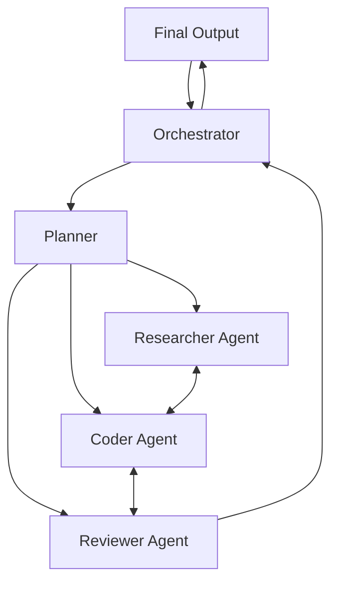

# Multi-Agent AI System

## Project Overview
This project aims to build a robust **Multi-Agent System (MAS)** where autonomous agents collaborate, compete, or coordinate to solve complex problems that are difficult for a single monolithic AI to handle. The system leverages Large Language Models (LLMs) as the cognitive core for individual agents, enabling them to plan, reason, and execute tasks within a shared environment.

## Theoretical Foundation

### 1. Agent Autonomy
Each agent operates as an independent entity with its own:
- **Persona/Role:** Specific domain knowledge or behavioral traits (e.g., "The Researcher," "The Coder," "The Critic").
- **Memory:** Short-term context windows and long-term vector database storage.
- **Tools:** Access to external APIs, file systems, or code execution environments.

### 2. Inter-Agent Communication
The core innovation lies in how agents interact. We utilize a structured communication protocol allowing for:
- **Direct Messaging:** Point-to-point communication between specific agents.
- **Broadcasting:** System-wide announcements.
- **Debate & Consensus:** Mechanisms for resolving conflicting outputs (e.g., a "Manager" agent mediating between a "Developer" and a "Tester").

### 3. Task Decomposition
Complex user queries are not solved linearly. The system employs a **Planner Agent** to:
1. Deconstruct the high-level goal into sub-tasks.
2. Assign sub-tasks to the most suitable specialized agents.
3. Aggregate results into a final coherent response.

## Project Goals

1.  **Scalability:** Create a modular architecture where new agent types can be added without disrupting existing workflows.
2.  **Resilience:** Ensure the system can recover from individual agent hallucinations or failures through peer review and iterative refinement.
3.  **Observability:** Provide clear logs and visualization of the "thought process" and conversation history between agents.
4.  **Practical Application:** Demonstrate the system's capability in scenarios such as automated software development, complex research synthesis, and creative writing collaboration.

## Architecture (High Level)

