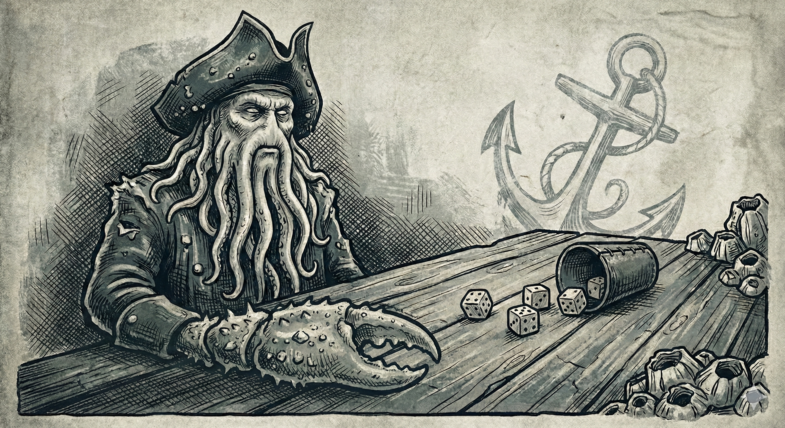

# Liar's Dice - Adaptive Strategy Learning Engine



This repository implements a **headless, modular Liar's Dice game engine** designed for AI research, agent development, and strategy analysis. The engine supports:

- **2 players (agents)**, default 5 dice per round (configurable distribution)
- **Clean separation** between game logic, agents, UI, and persistence
- **Turn-by-turn event recording** for replay, analysis, and training
- **Plug-and-play agent interface** for rule-based, statistical, or learning agents

## Project Overview

The engine models the abstract game of Liar's Dice, allowing you to:
- Run self-play matches between any agents
- Collect detailed event logs and state transitions
- Experiment with new agent strategies, including RL/DRL
- Analyze and classify opponent strategies from collected data

### Architecture
- **Core logic**: Game rules, state transitions, bid validation, dice rolling
- **Agents**: Abstract agent interface (`Agent`), with pluggable implementations (see `liars_dice/agents/`)
- **Persistence**: Event recording and replay (see `liars_dice/persistence/`)
- **UI**: (Optional, not required for engine use)

## Requirements

- Python 3.8+
- numpy
- gymnasium
- stable-baselines3
- sb3-contrib
- torch (PyTorch) — required for PPO (inference and training) and used by some training utilities (e.g., TensorBoard helper). Install CPU-only or CUDA-enabled builds as appropriate.
- tensorboard
- pandas (for data export/analysis)
- matplotlib (optional, for plotting)
- rich, tqdm (used by training scripts for progress output)

Install common packages with pip:

```powershell
pip install numpy gymnasium stable-baselines3 sb3-contrib torch tensorboard pandas matplotlib rich tqdm
```

Notes:
- `torch` is required to load and run the PPO model (stable-baselines3/sb3_contrib use PyTorch). It is also imported by the Nash/CFR training utilities for TensorBoard logging in this repository, so `torch` must be present to import those modules as written.
- If you only want to run the core engine and rule-based agents (no RL), you can omit `stable-baselines3`, `sb3-contrib`, and `torch`.
- For GPU acceleration, install a CUDA-enabled PyTorch build following the instructions at https://pytorch.org/.

## Installation

Clone the repository and (optionally) create a virtual environment:

```powershell
git clone <repo-url>
cd Adaptive-Strategy-Learning-in-Liar-s-Dice
python -m venv .venv
.venv\Scripts\activate
```

## Running Tests

Run all unit tests from Root:

```powershell
python -m unittest discover -s tests -v
```

## Available Scripts

The project includes several scripts for different simulation and testing scenarios:

### 1. `run_experiments.py` - Single-Round Games
Simulates individual **single-round games** between two agents. Each game ends when someone calls "Liar".

**Use case**: Quick testing, data collection, analyzing single-round strategies

**Run from project root**:
```powershell
python -m scripts.run_experiments
```

**Configuration**: Edit the script's `main()` function to set:
- `agent_1` and `agent_2`: Agent names (e.g., "random", "heuristic", "nash_cfr")
- `number_of_games`: How many games to run
- `data_dir`: Output directory for CSV files (default: "data")

**Output**: 
- `data/game_summary.csv`: Game results and statistics
- `data/game_trajectory.csv`: Turn-by-turn events and states

### 2. `full_game.py` - Full Multi-Round Matches
Simulates **complete matches** with multiple rounds. After each round, the loser loses 1 die. Match continues until one player reaches 0 dice.

**Use case**: Realistic gameplay simulation, testing endurance/adaptation strategies

**Run from project root**:
```powershell
python -m scripts.full_game
```

**Configuration**: Edit the script's `main()` function to set:
- `agent_1` and `agent_2`: Agent names
- `number_of_matches`: How many full matches to run
- `data_dir`: Output directory (default: "data")

**Output**:
- `data/match_summary.csv`: Match results with rounds played
- `data/match_trajectory.csv`: All events across all rounds

### 3. `run_tournament.py` - Single-Round Tournament
Runs a **round-robin tournament** where all agent pairings play single-round games against each other.

**Use case**: Comparing agent performance across single rounds

**Run from project root**:
```powershell
python -m scripts.run_tournament --agents all --games 10 --data-dir data
```

**Options**:
- `--agents`: Comma-separated agent list or "all" (e.g., "random,heuristic" or "all")
- `--games`: Number of games per ordered pairing
- `--data-dir`: Output directory

**Output**:
- `data/game_summary.csv`: Individual game results
- `data/game_trajectory.csv`: Turn-by-turn events
- `data/tournament_summary.csv`: Per-pairing statistics
- `data/agent_stats.csv`: Aggregated win rates per agent
- `data/win_percentages.png`: Win percentage chart

### 4. `run_tournament_full_game.py` - Full-Match Tournament
Same as tournament #3, but uses **full multi-round matches** instead of single rounds.

**Use case**: Comprehensive agent comparison with realistic match conditions

**Run from project root**:
```powershell
python -m scripts.run_tournament_full_game --agents all --games 10 --data-dir data
```

**Options**: Same as `run_tournament.py`

**Output**: Same files as `run_tournament.py` but with match-level data

## User Interfaces

The project includes both CLI and GUI interfaces for human play:

### CLI (Command-Line Interface)

Play Liar's Dice in the terminal against an agent.

**Run from project root**:
```powershell
python -m UI.cli
```

**Features**:
- Interactive text-based gameplay
- Choose from available agents
- View game rules
- All games are saved to `data/game_summary.csv` and `data/game_trajectory.csv`

**Controls**:
- Menu navigation: Enter 1, 2, or 3
- Actions: Choose "Bid" or "Call Liar"
- Input bids: Enter quantity and face values when prompted

### GUI (Graphical Interface)

Play Liar's Dice with a visual interface.

**Run from project root**:
```powershell
python -m UI.gui
```

**Features**:
- Visual dice display (your dice shown, opponent's hidden)
- Interactive buttons for bidding and calling liar
- Bid history tracking
- Real-time game status updates
- All games are saved to `data/game_summary.csv` and `data/game_trajectory.csv`

**Controls**:
- Select opponent agent from dropdown
- Click "Start Game" to begin
- Enter quantity and face in text boxes
- Click "Bid" or "Call Liar" buttons
- Click "New Round" to play again

**Note**: Both CLI and GUI record game data to the same CSV files, allowing you to analyze human gameplay alongside agent self-play data.

## Advanced AI Agents

The engine includes two sophisticated AI agents that learn optimal strategies through different approaches:

### Nash/CFR Agent (Game-Theoretic Equilibrium)

The **NashCFRAgent** in this codebase is implemented using a sampling-based variant of Counterfactual Regret Minimization (CFR): External-Sampling Monte Carlo CFR (commonly shortened to MCCFR). MCCFR replaces full game-tree traversals with Monte Carlo sampling of trajectories to estimate counterfactual regrets, which makes it practical for the larger extensive-form game trees that arise in Liar's Dice.

- **Nash equilibrium:** a strategy profile (possibly mixed) where no player can increase their expected payoff by unilaterally deviating. In two-player zero-sum games like Liar's Dice, reaching a Nash equilibrium means the strategy is unexploitable in expectation against any opponent.
- **Counterfactual regret:** for a given information set and action, counterfactual regret measures the (expected) difference in payoff had the player chosen that action every time the information set was reached, compared to the actions actually taken. CFR algorithms iteratively accumulate positive counterfactual regrets and convert them into strategy probabilities (regret-matching).

These concepts motivate MCCFR: the algorithm estimates counterfactual regrets by sampling and uses regret-matching to build an average strategy that converges in expectation to a Nash equilibrium.

#### Theory (External-Sampling MCCFR)

This implementation uses External-Sampling MCCFR (a Monte Carlo CFR variant). Key points:

- Instead of exhaustively traversing every game-history node each iteration, MCCFR samples chance outcomes and opponent actions to estimate regrets and strategy updates, dramatically reducing per-iteration cost for large games.
- External-sampling means traversal nodes for the traversing player are fully expanded (to compute action utilities), while opponent nodes are sampled according to their current strategy. This yields unbiased regret estimates in expectation and enables efficient updates.
- The algorithm accumulates an average strategy (strategy sums) during training; the final policy maps information sets (a player's private dice and the public last-bid context) to mixed-action probabilities.
- MCCFR converges in expectation to a Nash equilibrium given sufficient iterations; convergence should be monitored via regret or strategy-delta metrics rather than instantaneous exploitability.

**Practical implications:**
- Scales to multi-dice configurations that would be infeasible for full-tree CFR.
- Supports per-configuration parallelization: each dice-count combination (e.g., (2,3)) can be trained independently and aggregated into the final policy dictionary.
- Checkpointing and TensorBoard logging are supported to track convergence diagnostics during long runs.

#### Training (how to run MCCFR here)

Train MCCFR policies for dice count combinations in parallel:

1. **Install requirements**:
    ```powershell
    pip install torch tensorboard
    ```

2. **Run training**:
    ```powershell
    python -m scripts.train_nash_cfr_agent --num_players 2 --max_dice 5 --iterations 1000000 --tensorboard runs/cfr_training
    ```

    **Parameters:**
    - `--iterations`: Number of MCCFR iterations per configuration (more iterations improves convergence).
    - `--tensorboard`: Directory for TensorBoard logs (convergence metrics and regret traces are logged here).
    - `--checkpoint`: Path to save intermediate policy checkpoints (the script stores a pickle with a `policies` dictionary and related metrics).

    The training script enumerates or accepts a set of dice-count combinations (e.g., all tuples from (1,1) to `(max_dice,...,max_dice)`) and trains each configuration. Checkpoint files are written as the run proceeds so long jobs can be resumed.

3. **Monitor convergence**:
    ```powershell
    tensorboard --logdir runs/cfr_training
    ```
    Open `http://localhost:6006` to inspect convergence plots, regret histories, and other logged diagnostics.

4. **Parallel / HPC usage**:
    ```bash
    #!/bin/bash
    #SBATCH --cpus-per-task=32
    #SBATCH --mem=16G
    #SBATCH --time=12:00:00

    python -m scripts.train_nash_cfr_agent --iterations 1000000
    ```

5. **Checkpointing and artifacts**:

- The trainer writes checkpoint pickles that contain accumulated `policies` and optional `metrics` for the trained configurations. When training is performed in parallel across processes or machines, the workflow saves partial policy files which are later merged into a single `nash_cfr_policy.pkl`.
- The training utilities in this repository now remove intermediate partial files after a successful merge to keep the weights directory tidy.

The trained policy dictionary is automatically loadable by `NashCFRAgent` when provided the appropriate weights file or in-memory policy mapping.

---

### PPO Agent (Deep Reinforcement Learning)

The **PPOAgent** uses **Proximal Policy Optimization** to learn strategies through self-play against diverse opponents.

#### Theory

PPO is a policy gradient reinforcement learning algorithm that learns by trial and error:

- **Policy Network**: Neural network that maps game observations to action probabilities
- **Value Network**: Estimates expected future rewards from current state
- **Clipped Objective**: Prevents destructive policy updates that hurt performance
- **Advantage Estimation**: Learns which actions are better than average

The agent learns through **curriculum training**: starting with simple opponents and progressively facing harder strategies, similar to how humans learn games.

**Key Properties:**
- Learns general strategies that adapt to opponent behavior
- Uses action masking to only consider legal moves
- Handles temporal sequences through history encoding
- Can discover novel strategies not based on game theory

#### Architecture

- **Observation**: Hand + dice counts + sliding window of last 10 actions (49-dim vector)
- **Policy**: 2-layer MLP [256, 256] with ReLU activations (adjustable)
- **Action Space**: Discrete (Call Liar + all valid bids)
- **Training**: MaskablePPO with entropy bonus for exploration

#### Training

The PPO agent now uses a **two-phase curriculum + loss-weighted extended training**:

1. **Install requirements**:
    ```powershell
    pip install sb3-contrib tensorboard gymnasium torch
    ```

2. **Run Training** (curriculum + extended loss-weighted phase):
    ```powershell
    python scripts/train_ppo_curriculum.py --fresh-start
    ```
    
    **Phase 1: Streamlined Curriculum (Sequential)**
    - Random Agent (50k) → ProbabilityMinRaise (100k) → Bayesian (150k) → Nash/CFR (200k if available)

    **Phase 2: Extended Curriculum (Loss-Weighted, Fixed Evaluation Set)**
    - Evaluate against all registered base opponents (fixed set, e.g., 50 games each)
    - Compute loss rates per opponent; sample opponents proportional to loss rate
    - Train in chunks (default 50k steps) and re-evaluate until no improvement for 5 checks or target reached

    **Key Features:**
    - Position randomization (plays both first/second)
    - Action masking for legal moves
    - Fixed evaluation set → stable, comparable metrics
    - Loss-weighted sampling focuses on current weaknesses without league churn
    - Auto-stop when average win rate plateaus or meets target

    **Training Options:**
    ```bash
    # Basic training
    python scripts/train_ppo_curriculum.py --fresh-start

    # Skip extended phase (curriculum only)
    python scripts.train_ppo_curriculum.py --fresh-start --skip-extended

    # Customize extended phase
    python scripts/train_ppo_curriculum.py --fresh-start \
        --timesteps 50000 \               # Curriculum stage timesteps
        --extended-timesteps 1000000 \    # Total steps for first extended chunk
        --eval-interval 50000 \           # Steps between eval checkpoints
        --evaluation-games 50 \           # Games per opponent per eval
        --win-rate-threshold 0.95         # Target average win rate to stop
    ```

        **Observed convergence (latest run):**
        - Reached ~94.5% average win rate against the fixed registered-opponent set in the extended phase.
        - Evaluation structure:

        ================================================================================
        EVALUATION CHECKPOINT X
        ================================================================================

        Opponent                       Win Rate        Wins/Games
        ------------------------------ --------------- ---------------
        ✓ AggressiveAgent              100.0% ████████████████████  50/50
        ⚠️ AggressiveRandomAgent         84.0% ████████████████░░░░  42/50
        ⚠️ AlternatorAgent               50.0% ██████████░░░░░░░░░░  25/50
        ⚠️ BayesianAgent                 50.0% ██████████░░░░░░░░░░  25/50
        .
        .
        .

        - Convergence history (average win rate):
            - Checkpoint 1: 87.8%
            - Checkpoint 2: 91.0%
            - Checkpoint 3: 92.5%
            - Checkpoint 4: 93.0%
            - Checkpoint 5: 94.5%
            - Checkpoint 6: 92.1%
            - Checkpoint 7: 94.1%
            - Checkpoint 8: 91.5%
            - Checkpoint 9: 93.8%
            - Checkpoint 10: 93.6%

3. **Monitor Training Progress**:
    ```powershell
    tensorboard --logdir=./runs/ppo_training/
    ```
    Open `http://localhost:6006` to view:
    - Episode rewards and win rates
    - Training loss curves
    - Per-opponent performance during curriculum

4. **Diagnostic Tools**:
    ```powershell
    # Watch agent play with detailed decision analysis
    python scripts/debug_agent_observations.py
    ```
    Shows what the agent sees (observations, action masks) and analyzes its bidding decisions in real-time.

#### Customizing Opponents

The dynamic league automatically discovers all registered agents using `AGENT_MAP`:

- **Add opponents**: Create agent with `@register_agent("name")` decorator
- **Exclude opponents**: Remove `@register_agent` decorator from agents you don't want evaluated
- The system automatically includes any new registered agents in evaluation

#### Troubleshooting

**Agent not improving:**
```bash
--league-timesteps 200000 --win-rate-threshold 0.85
```

**Training too slow:**
```bash
--evaluation-games 50 --league-timesteps 50000
```

**Can't master specific opponents:**
```bash
--mastery-threshold 0.90  # Lower threshold to 90%
```

#### Using the Trained Agent

After training completes, the agent is automatically available:

```python
from liars_dice.agents.ppo_agent import PPOAgent
agent = PPOAgent()  # Loads from weights/ppo_model.zip
```

Use in tournaments, GUI/CLI, or custom scripts.

---

### Adaptive Agent (Bayesian Opponent Identification + Specialist Experts)

The **Adaptive Agent** combines **Bayesian opponent modeling** with **specialist PPO experts** to achieve superior performance against diverse opponents. It identifies which opponent it's facing during gameplay and switches to the appropriate specialist expert.

#### Architecture

The system consists of:

1. **Specialist Experts**: PPO agents trained to achieve 99%+ win rate against specific opponents
2. **Neural Belief Tracker**: LSTM-based opponent classifier that updates beliefs from observed actions
3. **Generalist Fallback**: General-purpose PPO agent for when opponent identity is uncertain

#### Training the Adaptive System

**Prerequisites**: Train the generalist PPO agent first (see PPO Agent section above):

```bash
python scripts/train_ppo_curriculum.py --fresh-start
```

**Train the complete adaptive system** (all specialists + LSTM classifier):

```bash
python scripts/train_adaptive_agent.py --train-all
```

**Configuration Options:**
- `--train-all`: Train all 27 specialist experts + LSTM classifier
- `--train-classifier --classifier-samples 1000`: Train/retrain LSTM classifier only
- `--opponent bayesian`: Train single specialist expert (e.g., "bayesian")
- `--evaluate-experts`: Evaluate performance of all trained experts

**What This Does:**
1. Trains a specialist expert for each opponent (warm-started from generalist)
2. Collects 1000 games per opponent for LSTM training data
3. Trains 2-layer LSTM (128 hidden) with attention mechanism
4. Evaluates all experts and displays win rates

**Output Files:**
- `liars_dice/agents/weights/adaptive_models/expert_<OpponentName>.zip` (one per opponent)
- `liars_dice/agents/weights/adaptive_models/neural_classifier.pt` (LSTM classifier)
- TensorBoard logs in `runs/adaptive_agent/classifier/`

#### Using the Adaptive Agent

**In Python:**

```python
from liars_dice.agents.adaptive_agent import AdaptiveAgent

# Create agent
agent = AdaptiveAgent()

# In game loop
view = engine.get_view(player_id)
action = agent.choose_action(view)

# Check belief state
belief_summary = agent.get_belief_summary()
print(belief_summary)
# {
#   'beliefs': {'RandomAgent': 0.15, 'BayesianAgent': 0.75, ...},
#   'entropy': 0.823,
#   'observations': 7,
#   'current_expert': 'BayesianAgent'
# }
```

**In Tournaments:**

The adaptive agent is automatically registered:

```python
from liars_dice.agents import AGENT_MAP

agent = AGENT_MAP["adaptive"]
```

#### How It Works

1. **Online Belief Update**: At each opponent action, extracts features and updates belief distribution using Bayes' rule
2. **Expert Selection**: Once confidence exceeds threshold (default 70%) and minimum observations (5 actions) reached, switches to specialist expert
3. **Fallback**: Uses generalist agent during uncertainty phase
4. **Feature Extraction**: 12-dimensional features from bid quantity, face, aggressiveness, probability, etc.

#### Parameters

**AdaptiveAgent Constructor:**

```python
AdaptiveAgent(
    confidence_threshold=0.7,   # Min belief to commit to expert (70%)
    min_observations=5,          # Min actions before prediction
    neural_classifier_path=None, # Auto-loads from config
    experts_dir=None,            # Auto-loads from config
    generalist_path=None         # Auto-loads from config
)
```

#### Performance

**Specialist Expert Win Rates:** Each expert achieves 99%+ against its specific opponent

**Adaptive Agent Performance:**
- Against known opponents: 95-99% (once identified)
- First few rounds: 70-85% (using generalist)
- Against unknown opponents: Falls back to generalist (~70-80%)

#### Monitoring Training

```bash
tensorboard --logdir=./runs/adaptive_agent/classifier/
```

View LSTM training curves, convergence metrics, loss/accuracy tracking.

#### Troubleshooting

**LSTM classifier not found:**
```bash
python scripts/train_adaptive_agent.py --train-classifier
```

**Experts not found:**
```bash
python scripts/train_adaptive_agent.py --train-all
```

**Low identification accuracy:**
- Increase classifier samples: `--classifier-samples 2000`
- Lower confidence threshold: `AdaptiveAgent(confidence_threshold=0.5)`

---

## How to Use the Engine

### 1. Create Agents
Implement new agents by subclassing `Agent` (see `liars_dice/agents/base.py`). Example: `RandomAgent` in `liars_dice/agents/random_agent.py`.


### 2. Running the Engine

You can use the engine in two main ways:

#### A. Running from Python (Agent-vs-Agent / Self-Play)
Use this mode to run automated matches between agents, collect data, or train AI models. This is ideal for research, self-play, and batch experiments.

**Option 1: Two agents playing against each other (single game)**

```python
from liars_dice.core.config import GameConfig
from liars_dice.core.engine import GameEngine
from liars_dice.agents.random_agent import RandomAgent

config = GameConfig(dice_distribution=(2,3), ones_wild=False, rng_seed=42)
engine = GameEngine(config)
agent0 = RandomAgent()
agent1 = RandomAgent()

engine.start_new_round()
while not engine.is_terminal():
    current = engine.state.public.current_player
    agent = agent0 if current == 0 else agent1
    view = engine.get_view(current)
    action = agent.choose_action(view)
    engine.apply_action(current, action)
```

**Option 2: Batch self-play experiments (multiple games, data collection)**

You can run a batch of games and collect results using the provided experiment script (from the project's root):

```powershell
python -m scripts.run_experiments
```

Edit the configuration section at the top of scripts/run_experiments.py to set the number of games, agent types, and output directory. Results and statistics will be saved to the specified directory (default: ../results).

**Purpose:**
- Run self-play matches between any agents (single or batch)
- Collect event/state data for analysis or training
- Useful for developing/testing new agent strategies

#### B. Running the User Interfaces (Human-vs-Agent)
Use the CLI or GUI to play interactively as a human against an agent. This is ideal for manual testing, demos, or playing the game yourself.

**CLI Example:**
```powershell
python -m UI.cli
```

**GUI Example:**
```powershell
python -m UI.gui
```

**Purpose:**
- Play as a human against a bot
- Useful for debugging, demonstrations, or exploring the game manually
- Both interfaces save game data to CSV files for later analysis

For detailed UI usage, see the **User Interfaces** section above.

---

### 4. Collecting Data

Data is persisted to two CSV outputs by default when running the scripts and UIs:

- `data/game_summary.csv` — one line per completed game/match
- `data/game_trajectory.csv` — one line per event/action within games (turn-level)

These files follow the headers defined in `liars_dice/persistence/csv_io.py`:

- Summary columns (`liars_dice/persistence/csv_io.SUMMARY_HEADER`):
    - `game_id`, `game_index`, `timestamp`, `agent0`, `agent1`, `winner`, `loser`,
    - `steps`, `bids`, `calls`, `bluffs_called`, `error`, `end_reason`,
    - `starting_dice_per_player`, `rounds_played`

- Trajectory columns (`liars_dice/persistence/csv_io.TRAJECTORY_HEADER`):
    - `game_id`, `round`, `event_type`, `turn_index`, `player`, `player_type`,
    - `payload`, `timestamp`, `state`, `action`, `reward`

How to interpret these files:

- `game_summary.csv` provides match-level / game-level metadata and aggregated counts (e.g., number of bids/calls, winner/loser, rounds played).
- `game_trajectory.csv` contains a complete, ordered event stream for each game. Each row is a single in-round event (bid, call, dice reveal, etc.) with a `payload` and `state` column that capture the event-specific data and a compact state snapshot useful for replay or supervised learning.

Where the data is written from code:

- The CSV helpers live in `liars_dice/persistence/csv_io.py` (functions `append_row_to_csv`, `append_rows_to_csv`).
- Higher-level recorders and adapters (for in-memory or file recording) are implemented under `liars_dice/persistence/` and the game scripts call these utilities when a game or round completes.

If you need a different format (JSON, database, Parquet), replace or extend the recorder in `liars_dice/persistence/recorder.py` to emit the desired outputs.

Example: inspect current headers programmatically:

```python
from liars_dice.persistence.csv_io import get_summary_header, get_trajectory_header
print(get_summary_header())
print(get_trajectory_header())
```

Note: CSV schema may evolve; prefer using the helper functions above to get authoritative headers when ingesting the files.